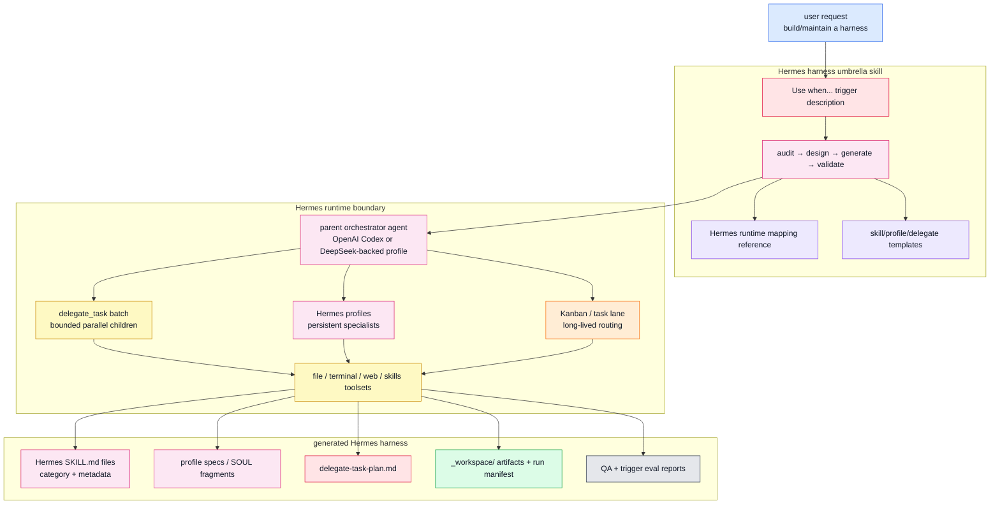
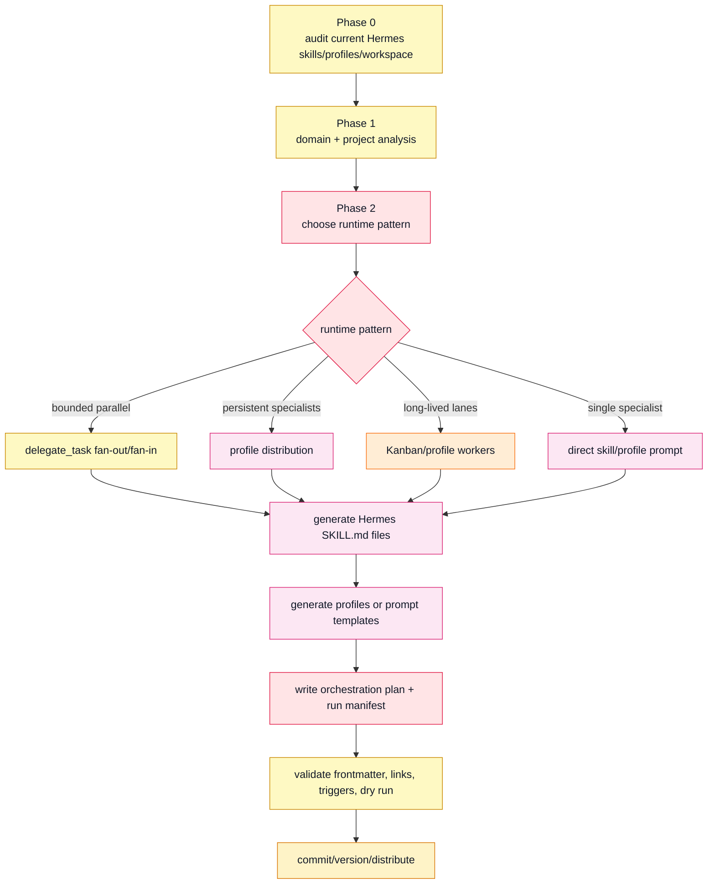
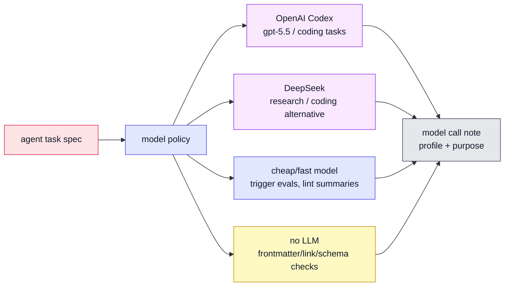
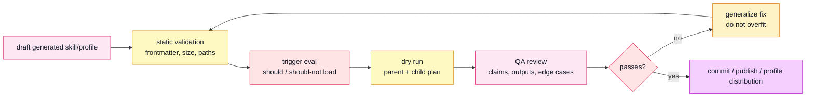

<!-- markdownlint-disable MD013 MD060 -->

# Hermes Skill Translation Plan for Harness

> Status: adapter plan, not current Harness runtime behavior.
> Scope: translate the Harness concept into Hermes-compatible skills, profiles,
> and orchestration patterns without smuggling Claude Code assumptions into
> Hermes.

## 1. Working Decision

Port Harness to Hermes as a design-time skill factory, not as a literal
`TeamCreate` clone.

The Claude Code version writes `.claude/agents`, `.claude/skills`, and a
`CLAUDE.md` pointer. The Hermes version should write Hermes skills, profile or
agent specs, orchestration plans, and workspace artifacts using Hermes-native
contracts.

| Decision | Rationale |
|---|---|
| Use one umbrella Hermes skill first. | Avoid ten cute micro-skills and keep the workflow coherent. |
| Keep runtime adapters explicit. | Claude Code, Hermes, Codex, and DeepSeek-backed workers do not share the same primitives. |
| Prefer parent-orchestrated fan-out/fan-in for Hermes. | Hermes `delegate_task` children are isolated and do not freely message each other. |
| Preserve `_workspace/`. | File-based handoff is runtime-independent and auditable. |
| Replace `model: "opus"` with capability/model policy. | Hermes routes through profiles/providers such as OpenAI Codex and DeepSeek. |

## 2. Confirmed Current State

| Harness concept | Current implementation |
|---|---|
| Distribution | Claude plugin manifests in `.claude-plugin/` |
| Trigger skill | `skills/harness/SKILL.md` with Korean-first description/body |
| Agent definitions | Generated under `.claude/agents/*.md` |
| Skill definitions | Generated under `.claude/skills/*/SKILL.md` |
| Team runtime | Claude Code Agent Teams API: `TeamCreate`, `SendMessage`, `TaskCreate` |
| Lightweight subagents | Claude Code `Agent` tool with `run_in_background` |
| Project pointer | `CLAUDE.md` trigger + change history |
| Durable handoff | `_workspace/phase_agent_artifact.md` |
| Model policy | Hard-coded guidance to use `model: "opus"` |

## 3. Hermes Translation Map

| Harness / Claude Code | Hermes equivalent | Gap | Recommendation |
|---|---|---|---|
| `.claude-plugin/plugin.json` | Hermes Skills Hub/tap metadata or profile distribution metadata | Hermes does not load Claude plugin manifests. | Preserve metadata in skill frontmatter and optional distribution docs. |
| `skills/harness/SKILL.md` | `skills/autonomous-ai-agents/harness/SKILL.md` or user-local `~/.hermes/skills/...` | Current repo path lacks Hermes category placement. | For Hermes core/tap usage, add category layout and peer metadata. |
| Minimal frontmatter | Hermes peer frontmatter | Hermes expects richer conventions even if validator only requires name/description. | Add `version`, `author`, `license`, `metadata.hermes.tags`, `related_skills`. |
| Korean-only body | English Hermes umbrella skill with multilingual triggers | Discoverability suffers for non-Korean Hermes users. | Translate core body; preserve Korean/Japanese trigger phrases. |
| `.claude/agents/*.md` | Hermes profile specs, `SOUL.md` fragments, or delegate prompt templates | `delegate_task` does not load `.claude/agents`. | Generate persistent profile templates or ephemeral child prompts. |
| `.claude/skills/*` | Hermes skills under profile/user/repo skill tree | Different layout and validation rules. | Generate Hermes `SKILL.md` files with category and metadata. |
| `TeamCreate` | `delegate_task(tasks=[...])`, profile fleet, or Kanban workers | No native child-to-child team chat in simple delegation. | Default to parent-mediated fan-out/fan-in. Use Kanban/profile workers for durable teams. |
| `SendMessage` | Parent synthesis, shared files, Kanban/task comments | Leaf subagents cannot message each other. | Require file artifacts and parent aggregation. |
| `TaskCreate` / `TaskUpdate` | `todo`, Kanban, or `_workspace/tasks.json` | `delegate_task` batch has no shared board. | Use parent-owned task state or Kanban for long-lived lanes. |
| `Agent(..., run_in_background)` | `delegate_task` batch or `terminal(background=True)` for shell jobs | Delegate children are synchronous to the parent turn. | Use delegate batch for bounded reasoning; background terminal/cron for durable jobs. |
| `CLAUDE.md` pointer | Hermes project docs, profile distribution, profile description, optional `SOUL.md` | Hermes will not automatically treat `CLAUDE.md` as control plane. | Use profile/distribution metadata; avoid mutating `SOUL.md` unless creating a profile. |
| `model: "opus"` | Hermes provider/model/profile config | Hard-coded Anthropic names are wrong for Codex/DeepSeek. | Use model classes: orchestrator, builder, evaluator, researcher. Bind via profile config. |
| `Explore` / `Plan` / `general-purpose` | Hermes toolsets + profile personas | Tool access model differs. | Map to `file` read-only, `web` research, `terminal+file` implementation/QA. |
| QA agent | Hermes QA child with `terminal` + `file` toolsets | Same methodology, different tool syntax. | Parent must verify QA results because subagent summaries are self-reports. |
| Trigger evals | Fresh Hermes sessions + direct validator scripts | Current session skill loader is cached. | Test in a new Hermes session or validate files directly. |

## 4. Proposed Hermes Skill Layout

The first useful port should be one umbrella skill with references, not a swarm
of underbaked children.

```text
skills/autonomous-ai-agents/harness/
├── SKILL.md
├── references/
│   ├── hermes-runtime-mapping.md
│   ├── architecture-patterns.md
│   ├── orchestrator-templates.md
│   ├── generated-skill-authoring.md
│   ├── testing-and-evaluation.md
│   └── qa-agent-guide.md
├── templates/
│   ├── generated-skill.md
│   ├── delegate-task-plan.md
│   ├── profile-spec.yaml
│   └── run-manifest.json
└── scripts/
    └── validate_generated_harness.py
```

### `SKILL.md` frontmatter shape

```yaml
---
name: harness
description: Use when designing or maintaining a Hermes agent harness: agent teams, specialist profiles, generated skills, orchestration workflows, delegate_task plans, profile distributions, QA loops, or translations from Claude Code Harness. Trigger on "build a harness", "agent team", "skill factory", "하네스 구성", and "ハーネス" requests.
version: 1.0.0
author: Hermes Agent
license: Apache-2.0
metadata:
  hermes:
    tags: [harness, multi-agent, orchestration, skill-authoring, profiles]
    related_skills: [hermes-agent, hermes-agent-skill-authoring, dispatching-parallel-agents]
---
```

Keep the body around 8-15k characters. Put the heavy Claude comparison and
pattern catalog in `references/`.

## 5. Hermes Adapter Architecture



## 6. Hermes Workflow Translation



## 7. Runtime Pattern Mapping

| Harness pattern | Hermes default | Hermes advanced | Notes |
|---|---|---|---|
| Pipeline | Sequential parent steps; pass files between steps. | Dedicated profile per stage. | Keep artifacts in `_workspace/`. |
| Fan-out / fan-in | `delegate_task(tasks=[...])` batch. | Kanban worker lane per perspective. | Parent synthesizes; children do not chat. |
| Expert pool | Conditional delegate/profile route. | Profile fleet with skill tags. | Route only the needed experts. |
| Producer-reviewer | Producer delegate then reviewer delegate. | Iterative evaluator/evolver profile. | Parent gates retries. |
| Supervisor | Parent orchestrator owns task state. | Kanban/profile control plane. | Avoid pretending children share a task board. |
| Hierarchical delegation | Avoid by default. | `delegate_task(role="orchestrator")` only when nested delegation is intentionally enabled. | Cost and context blow up fast. |

## 8. Model and Provider Policy

The Hermes port should not hard-code `opus`. It should specify capability tiers
and bind them through profiles/config.



Recommended tiers:

| Tier | Use | Example binding |
|---|---|---|
| Orchestrator | Decomposition, synthesis, final decisions | `orchestrator` profile on OpenAI Codex. |
| Builder | File creation, code/doc implementation | OpenAI Codex or DeepSeek coding model. |
| Researcher | Repo/web/doc reconnaissance | DeepSeek or Codex with `web`/`file` tools. |
| Evaluator | QA, trigger tests, schema checks | Codex/DeepSeek plus deterministic scripts. |
| Deterministic | Frontmatter, links, file existence, JSON schema | Python scripts; no model. |

## 9. Generated Hermes Contracts

### Generated skill contract

```yaml
generated_skill:
  path: skills/<category>/<skill-name>/SKILL.md
  frontmatter:
    required:
      - name
      - description
    peer_recommended:
      - version
      - author
      - license
      - metadata.hermes.tags
      - metadata.hermes.related_skills
  limits:
    description_max_chars: 1024
    file_max_chars: 100000
  body_required:
    - overview
    - when_to_use
    - workflow
    - pitfalls
    - verification_checklist
  resources_allowed:
    - references/
    - templates/
    - scripts/
    - assets/
```

### Agent/profile spec contract

```yaml
agent_spec:
  id: <specialist-name>
  runtime: hermes-profile | delegate-template | kanban-worker
  purpose: <one-line role>
  reads:
    - <source paths or context packs>
  writes:
    - <artifact paths>
  toolsets:
    - file
    - terminal
    - web
  model_policy:
    class: builder | researcher | evaluator | orchestrator
    provider_preference: openai-codex | deepseek | inherit
  authority:
    can_edit_files: true|false
    can_run_commands: true|false
    can_publish_or_push: false
```

### Run manifest contract

```json
{
  "run_id": "2026-05-30-example",
  "domain": "example-domain",
  "runtime": "hermes-delegate-task",
  "orchestrator_profile": "orchestrator",
  "model_policy": {
    "orchestrator": "openai-codex/gpt-5.5",
    "allowed_child_families": ["openai-codex", "deepseek"]
  },
  "artifacts": [
    {
      "phase": "01",
      "agent": "researcher",
      "path": "_workspace/01_researcher_findings.md",
      "status": "complete"
    }
  ],
  "validation": {
    "frontmatter": "passed",
    "links": "passed",
    "trigger_eval": "pending"
  }
}
```

## 10. Validation Loop



Minimum checks for a Hermes port:

- `SKILL.md` starts at byte 0 with `---`.
- `name` and `description` exist.
- Description is <= 1024 chars and starts with `Use when ...`.
- Body is non-empty and under 100,000 chars.
- Skill path uses a category directory when bundled in a repo.
- Related skills resolve or are explicitly optional/local.
- New skills are tested in a fresh Hermes session, not only the session that
  created them.
- Parent verifies subagent outputs with real file reads or command output.

## 11. Implementation Phases

| Phase | Build now? | Output | Notes |
|---|---:|---|---|
| 0. Architecture docs | Yes | This plan + system maps | Establish boundary before writing a port. |
| 1. Umbrella skill | Yes | `skills/autonomous-ai-agents/harness/SKILL.md` | English body, multilingual triggers. |
| 2. Reference migration | Yes | `references/*.md` | Keep Claude-specific details behind runtime mapping. |
| 3. Validation script | Yes | `scripts/validate_generated_harness.py` | Deterministic checks beat vibes. |
| 4. Profile templates | Soon | `templates/profile-spec.yaml` | Needed for persistent specialists. |
| 5. Full profile distribution | Later | Hermes distribution package | Build after one generated harness works. |
| 6. Kanban worker integration | Later | Durable worker lane example | Only after simple delegate flow proves useful. |

## 12. Open Questions

| Question | Why it matters | Default answer |
|---|---|---|
| Should the Hermes port live in this repo? | Could confuse Claude Code users. | Start as docs/adapter plan here; prototype in Hermes skills repo or a fork. |
| Should generated agents become profiles or prompt templates? | Profiles are durable but heavier. | Prompt templates first; profiles for recurring teams. |
| Should children use OpenAI Codex or DeepSeek by default? | Cost, latency, and auth differ by environment. | Inherit parent unless the profile explicitly binds a model. |
| Should `SOUL.md` be edited by the generator? | Dangerous global behavior mutation. | No, unless creating a named profile distribution. |
| Should generated skills be user-local or repo-bundled? | Distribution and review path differ. | Repo-bundled for shared/public harnesses; user-local for personal scratch. |

## 13. Design Verdict

The translation is viable, but only if Harness is treated as a compiler for
agent-team architecture, not a Claude Code primitive emulator.

Best next move: build a Hermes umbrella skill plus `hermes-runtime-mapping.md`,
then test it by generating one tiny harness with three roles:
researcher, builder, evaluator. If that loop cannot produce validated skill
files and a run manifest, do not scale it. Scaling broken choreography just makes
more expensive mud.
