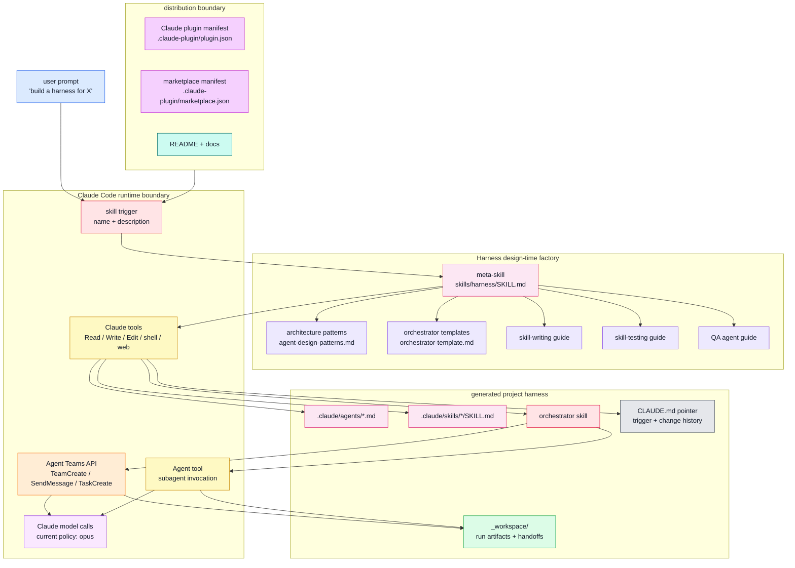
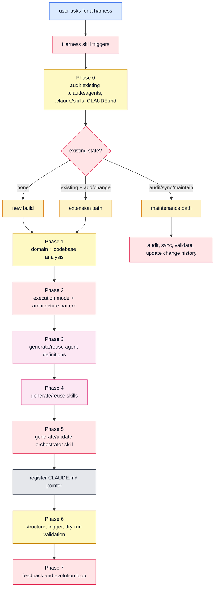
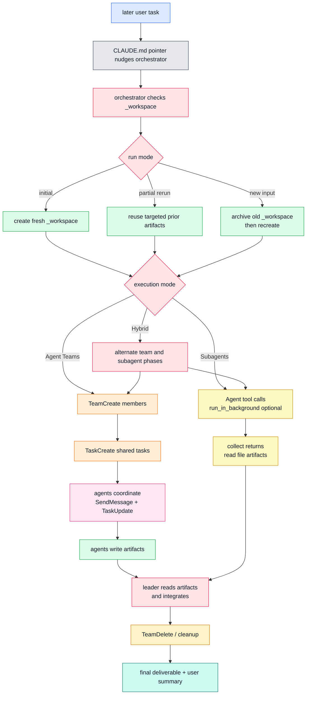
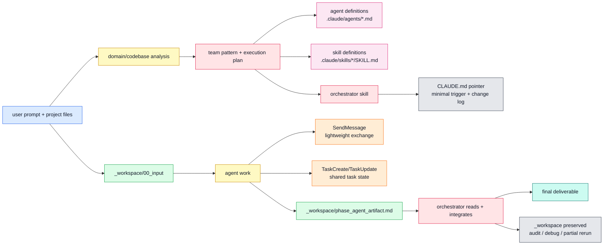
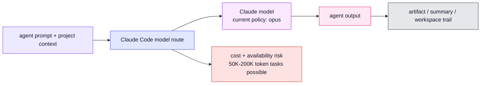
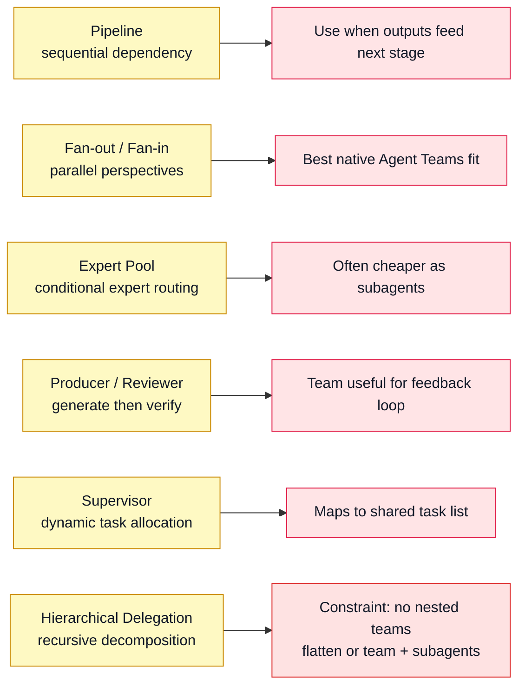
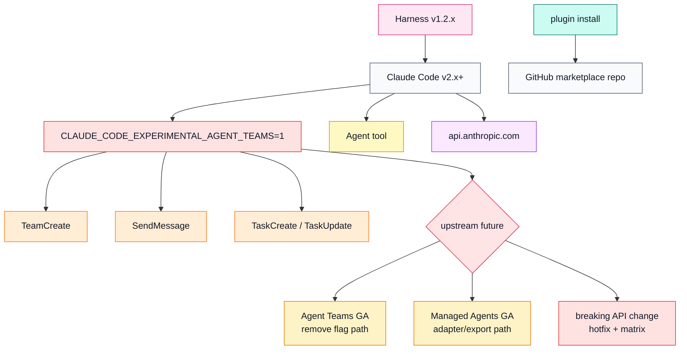

<!-- markdownlint-disable MD013 MD060 -->

# Harness System Design Maps

> Status: draft architecture reference, not runtime canon.
> Scope: current `revfactory/harness` repository as of 2026-05-30.
> Audience: contributors who need to understand what Harness is, where the
> runtime boundary is, and what should be built or documented next.

## 1. Working Decision

Harness is a Claude Code meta-skill and plugin that turns a domain request into
project-local agent-team architecture.

It is not a standalone multi-agent runtime. The repo ships instructions,
reference patterns, and plugin metadata; Claude Code Agent Teams executes the
result.

| Type | Fact |
|---|---|
| Product/system | Harness — team-architecture factory for Claude Code |
| Kernel | `skills/harness/SKILL.md` |
| Reference modules | `skills/harness/references/*.md` |
| Distribution | `.claude-plugin/plugin.json`, `.claude-plugin/marketplace.json` |
| Generated outputs | `.claude/agents/`, `.claude/skills/`, orchestrator skill, `CLAUDE.md` pointer, `_workspace/` artifacts |
| Primary runtime dependency | Claude Code v2.x Agent Teams with `CLAUDE_CODE_EXPERIMENTAL_AGENT_TEAMS=1` |

Assumptions and boundaries:

| Assumption | Confidence | How to verify |
|---|---:|---|
| Harness itself does not execute teams; Claude Code does. | High | Repo contains no standalone runtime code or workflow engine. |
| `_workspace/` is the durable run/audit surface. | High | `SKILL.md` and orchestrator template preserve it for handoff and reruns. |
| The six architecture patterns are conceptual templates, not compiled graph specs. | High | Patterns live as Markdown guidance. |
| Future cross-runtime support should be an adapter layer, not a rewrite of the concept. | Medium | Validate by prototyping a Hermes adapter from the existing skill. |

Non-goals for this document:

- Do not redesign Harness into a new product.
- Do not treat dashboards as value by themselves.
- Do not imply deterministic generation where the current repo relies on model
  instruction following.
- Do not promote Hermes translation work as current Harness functionality.

## 2. Product Definition

Harness is a design-time factory for building agent teams and their skills from
a compact domain description.

This is for:

- Claude Code users who want reusable, project-local specialist teams.
- Contributors reviewing or extending the Harness meta-skill.
- Runtime-adapter authors who need to port the concept to another agent system.

This is not:

- A generic LangGraph-style state machine runtime.
- A hosted orchestration service.
- A deterministic code generator with a typed compiler pipeline.

## 3. Core Properties and Planes

| Property | Requirement |
|---|---|
| Design-time factory | Generate durable project artifacts before repeated execution. |
| Runtime boundary clarity | Keep Harness distinct from Claude Code Agent Teams. |
| File-first memory | Preserve generated definitions and `_workspace/` artifacts. |
| Progressive disclosure | Keep the trigger skill lean; load references only when needed. |
| Drift-aware maintenance | Audit existing agents, skills, pointers, and workspace state first. |
| Explicit orchestration | Name agents, roles, inputs, outputs, and handoff paths. |
| Validation loop | Test structure, trigger behavior, dry-runs, and with-skill deltas. |
| Model policy visibility | State model assumptions and cost/runtime implications directly. |

| Plane | Components | Job |
|---|---|---|
| Data plane | Project files, user prompt, `_workspace/`, generated Markdown | Carry input, intermediate artifacts, and outputs. |
| Truth/control plane | `CLAUDE.md` pointer, change history, Phase 0 audit, validation checklist | Decide what exists, what changed, and what is safe to run. |
| Agent plane | Generated `.claude/agents/*.md`, orchestrator skill, QA agent guidance | Define who acts and what each agent may produce. |
| Model plane | Claude Code model calls, current `model: "opus"` policy | Route reasoning/execution through capable Claude models. |
| Product plane | Claude plugin, global skill install, README/quickstart | Let users install, trigger, and understand Harness. |
| Export/extension plane | Generated skills, references, future runtime adapters | Package the pattern for other domains and runtimes. |

## 4. Master Map



## 5. Layer Responsibilities

| Layer | Name | Owns | Does not own |
|---|---|---|---|
| L0 | Packaging | Plugin and marketplace metadata | Runtime behavior |
| L1 | Trigger skill | When Harness activates and which references to load | Agent execution state |
| L2 | Pattern library | Six team architecture patterns and selection guidance | Generated project truth |
| L3 | Generator workflow | Audit, analysis, agent/skill/orchestrator creation | Deterministic compilation guarantees |
| L4 | Generated harness | Project-local agents, skills, pointer, workspace | Global plugin distribution |
| L5 | Claude Code runtime | Team creation, message passing, task state, model calls | Harness documentation upkeep |
| L6 | Validation/evolution | Trigger checks, dry-runs, QA, change history | Hidden autonomous mutation |

## 6. Generation Flow



## 7. Runtime Execution Flow



## 8. Data and Truth Boundaries



Truth rules:

| Object | Truth status | Notes |
|---|---|---|
| `skills/harness/SKILL.md` | Source for the current factory workflow | Human-authored meta-skill, not generated state. |
| Reference files | Source for pattern/detail guidance | Loaded conditionally by the skill. |
| `.claude/agents/*.md` | Generated project-local role specs | Must be audited before extension to avoid duplicates. |
| `.claude/skills/*/SKILL.md` | Generated project-local operating procedures | Skills are the reusable "how" for each agent. |
| Orchestrator skill | Generated project-local control plane | Owns who runs when and how artifacts move. |
| `CLAUDE.md` pointer | Minimal project entrypoint | Should not duplicate the whole team inventory. |
| `_workspace/` | Run evidence and handoff staging | Preserved for audit, partial reruns, and debugging. |
| SendMessage/task state | Runtime coordination state | Useful but less durable than files. |

## 9. Agent and Worker Contracts

Agents make judgments. Workers transform or validate artifacts.

| Agent/worker | Purpose | Reads | Writes | Authority |
|---|---|---|---|---|
| Harness meta-skill | Design a project harness | User prompt, project files, existing harness state, references | Generated agent/skill/orchestrator files | May create/update design artifacts after audit. |
| Generated orchestrator | Coordinate a domain team | `CLAUDE.md`, `_workspace/`, generated agent/skill files | `_workspace/`, final output, change history | Owns workflow sequencing and fallback. |
| Generated specialist agent | Perform a bounded domain role | Assigned input, prior artifacts, role skill | Assigned artifact path | Writes only its assigned artifact unless told otherwise. |
| QA agent | Cross-check output and boundary assumptions | Source files, API/UI shapes, generated output, tests | QA report, issue list, optional fixes if authorized | Verifies, does not rubber-stamp existence checks. |
| Trigger evaluator | Test skill descriptions and near misses | Candidate descriptions and eval prompts | Trigger pass/fail report | Recommends description changes. |

### Core generated artifact schemas

```yaml
agent_definition:
  path: .claude/agents/<agent-name>.md
  required_sections:
    - core_role
    - working_principles
    - input_output_protocol
    - error_handling
    - collaboration
    - team_communication_protocol_if_team_mode
```

```yaml
skill_definition:
  path: .claude/skills/<skill-name>/SKILL.md
  frontmatter:
    name: <skill-name>
    description: <trigger-rich description>
  body:
    - overview
    - workflow
    - outputs
    - pitfalls
    - verification
  optional_resources:
    - references/
    - scripts/
    - assets/
```

```yaml
run_artifact:
  root: _workspace/
  input_dir: _workspace/00_input/
  artifact_name: <phase>_<agent>_<artifact>.md
  final_output: <user-requested path or orchestrator default>
  preserve: true
```

## 10. Model Layer

Current Harness policy is Claude-specific: generated agent calls should use
`model: "opus"`. That is simple and quality-biased, but expensive and not
portable.



| Model class | Current use | Sensitive data policy | Gap |
|---|---|---|---|
| Claude Opus-class | All generated agents by policy | Governed by Claude Code runtime and user project context | No per-agent cost/fallback routing. |
| No-LLM deterministic checks | Markdown/YAML/frontmatter validation when scripted | Safe for local validation | Scripts are mostly methodology, not bundled automation. |
| Future adapter models | Hermes/Codex/DeepSeek/local routes | Must be explicit per adapter | Requires capability tiers, not hard-coded Claude names. |

## 11. Architecture Patterns



## 12. External Dependency Loop



## 13. Pluggability Model

Harness already has the right conceptual split: patterns, generated agents,
generated skills, and orchestration. The missing abstraction is a runtime
adapter.

```yaml
runtime_adapter:
  id: claude-code-agent-teams
  status: current
  input:
    - domain_request
    - project_context
    - existing_harness_state
  outputs:
    - agent_definitions
    - skill_definitions
    - orchestrator_skill
    - project_pointer
    - workspace_manifest_optional
  primitives:
    create_team: TeamCreate
    message_agent: SendMessage
    create_task: TaskCreate
    invoke_subagent: Agent
  model_policy: opus
  audit_surface: _workspace/
```

A future adapter should implement the same conceptual contract without copying
Claude-specific tool names into the core design.

## 14. MVP Spine for the Next Build Slice

The next useful module is not a dashboard. It is a manifest-backed generated
harness contract.

Closest time-to-value:

| Feature | Why now | Depends on |
|---|---|---|
| `_workspace/run-manifest.json` | Makes reruns, audit, and partial execution deterministic. | Artifact naming contract. |
| Adapter contract doc | Separates Harness from Claude Code primitive names. | This system map. |
| Cost/model policy table | Makes `model: "opus"` explicit and overrideable later. | Runtime adapter boundary. |
| Validation script | Turns methodology into repeatable checks. | Markdown/frontmatter schema. |

Deferred:

- Hosted dashboard.
- Multi-user permission system.
- Runtime state database.
- Full cross-runtime implementation before the adapter contract is proven.

## 15. Open Questions

| Question | Why it matters | Default assumption |
|---|---|---|
| Should generated runs include a machine-readable manifest? | Without it, drift detection is model/manual. | Yes, add as a docs-backed convention first. |
| Should model policy stay hard-coded to Opus? | Cost and portability suffer. | Keep for Claude path, but add model class language. |
| Should Hermes/Codex support live in this repo or a sibling repo? | Avoid confusing current users. | Start as an adapter design doc, then prototype separately. |
| Should README link architecture docs in all languages? | Discoverability vs i18n maintenance. | Add docs first; update localized READMEs only if maintainers want parity. |

## 16. Design Verdict

Harness is strongest as a team-architecture compiler written in Markdown:
pattern selection, role definition, skill authoring, orchestration, and
validation are all legible.

The weak spot is pretending runtime details are generic. They are not. Today the
runtime is Claude Code Agent Teams. Future ports should keep the Harness factory
abstraction and swap the runtime adapter underneath it.

Build next: a manifest-backed adapter contract plus a validation script. That
turns the useful methodology into something contributors can test instead of
just admire.
